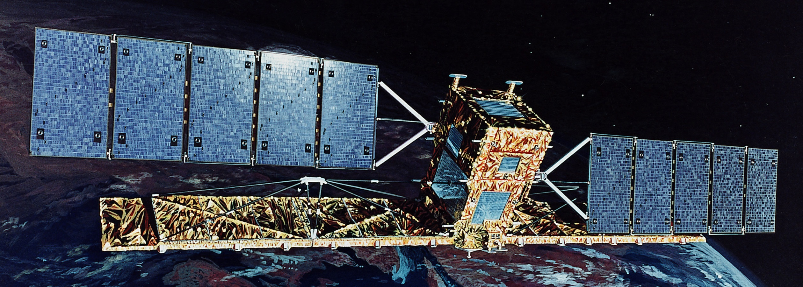



# Scripts RADARSAT-1 (English follows)

Dépôt contenant des fonctions d'aide utilisées pour accéder à des fichiers et les télécharger à partir d'un seau S3 contenant des images .tff de RADARSAT-1. Pour obtenir de plus amples renseignements sur le godet S3, consultez le [AWS Open Data Registry] (https://registry.opendata.aws/radarsat-1/). Pour en savoir plus sur RADARSAT-1, consultez le [site Web de l'Agence spatiale canadienne] (https://www.asc-csa.gc.ca/eng/satellites/radarsat1/what-is-radarsat1.asp).

Le fichier /src/ contient plusieurs exemples de scripts pour commencer :

- downloading_files.py est utilisé pour télécharger facilement des fichiers à partir du seau s3 en fonction de divers paramètres tels que la date, le pays ou les coordonnées.

- get_metadata.py est utilisé pour lire les métadonnées des fichiers sans avoir à les télécharger depuis le seau s3.

- sample_algorithms.py contient divers algorithmes simples qui peuvent être appliqués aux images pour démontrer les cas d'utilisation possibles.

Parallèlement à ces fichiers, un pipeline de données est réalisé pour créer un modèle ML capable de calculer la proportion d'un lac gelé à partir d'une image RADARSAT-1.

# RADARSAT-1 Scripts (Le français précède)

Repository containing helper functions used to access and download files from an S3 bucket containing .tff RADARSAT-1 images. More information regarding the AWS bucket can be found on the [AWS Open Data Registry](https://registry.opendata.aws/radarsat-1/). More information about RADARSAT-1 can be found on the [Canadian Space Agency website](https://www.asc-csa.gc.ca/eng/satellites/radarsat1/what-is-radarsat1.asp)

Inside the /src/ file are several sample scripts to start with:

- downloading_files.py is used to easily download files from the s3 bucket based on various metrics such as date, country, or coordinates.

- get_metadata.py is used to read metadata from the files without having to download them from the s3 bucket.

- sample_algorithms.py contains various simple algorithms that can be applied to the images to demonstrate possible use cases

Alongside these files is a data pipeline is being made to create an ML model that is able to calculate how much of a lake is frozen based on an RADARSAT-1 image.