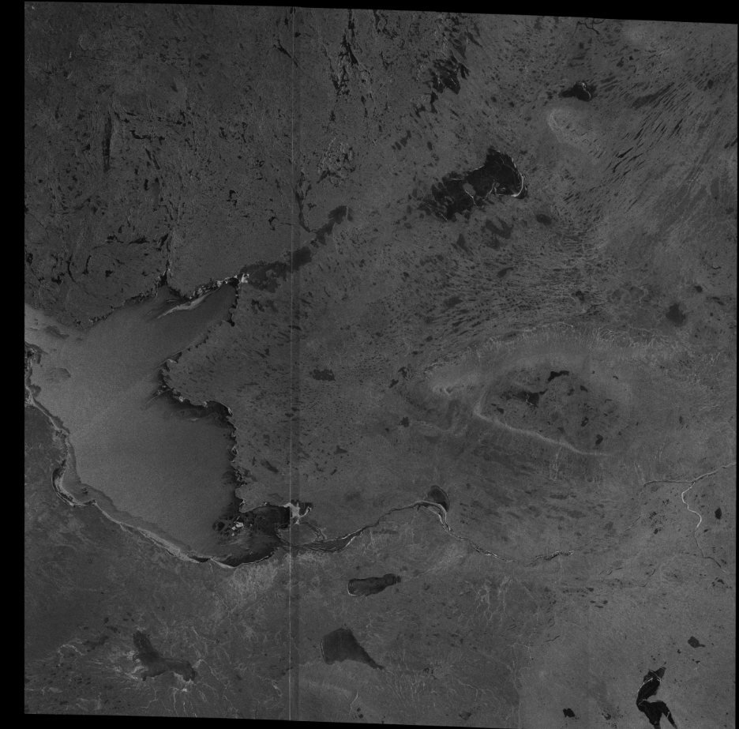
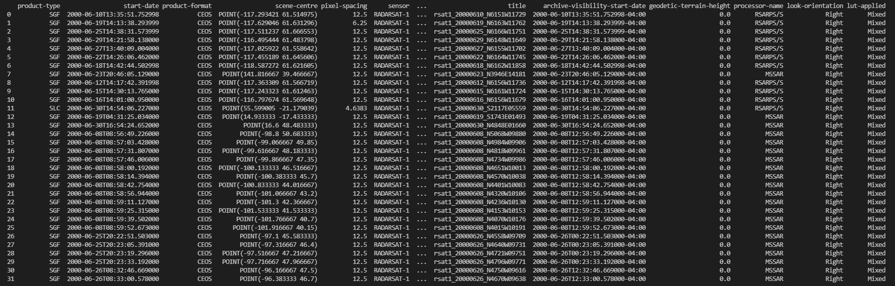
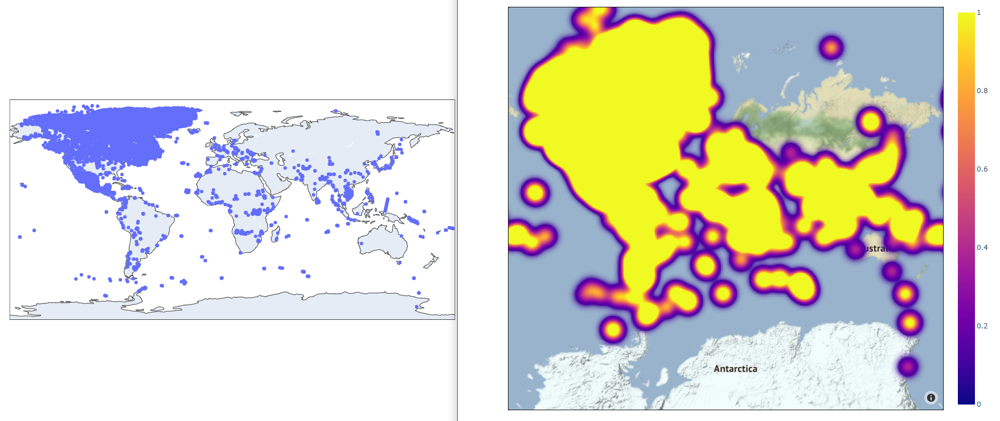
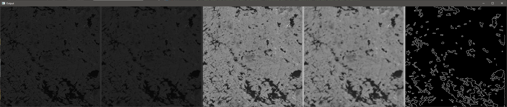
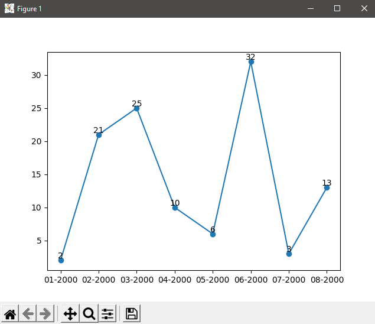

# Exemples de sorties pour les scripts RADARSAT-1 (English Follows)

Ce fichier contient des exemples de sorties lors de l'utilisation des scripts, ainsi qu'une brève explication.

## [downloading_files.py](downloading_files.py)

Ce fichier contient 5 exemples de fonctions à utiliser pour télécharger l'imagerie du satellite RADARSAT-1.

* download_directory(year, month, limit) - Télécharge jusqu'à *limit* images d'une année et d'un mois donnés.
* download_all() - Télécharge toutes les images dans le seau S3. Notez que cela peut prendre une quantité importante de stockage.
* download_file(file_name) - Télécharge un fichier donné depuis le seau S3.
* download_by_country(country_name, limit) - Télécharge jusqu'à *limit* images d'un pays donné.
* download_by_coordinates(latitude, longitude, range, limite) - Télécharge jusqu'à *limite* les images dans un carré *range x range* d'une latitude et d'une longitude données.

Les images seront téléchargées dans un répertoire *année/mois* où le script est exécuté. Voici un exemple d'image téléchargée depuis le satellite :

.

L'image contient également des données de géoréférence, ce qui permet de l'ouvrir avec QGIS ou GDAL.

## [get_metadata.py](get_metadata.py)

Ce fichier contient 4 exemples de fonctions permettant de télécharger les métadonnées des images sans télécharger l'image elle-même. Les données sont ensuite retournées sous forme de DataFrame Pandas.

* get_data_from_month_and_year(year, month) - Récupère toutes les métadonnées des images d'un mois et d'une année donnés.
* get_data_from_date_range(start_year, start_month, end_year, end_month) - Récupère toutes les métadonnées des images entre un mois de départ et un mois d'arrivée.
* get_data_by_country(country_name) - Récupère toutes les métadonnées pour les images d'un pays donné
* get_data_from_filename(file_name) - Récupère toutes les métadonnées pour une image spécifique.

Un exemple de sortie suivant un appel de `get_data_from_month_and_year(2000, 6)` est :

## [sample_algorithms.py](sample_algorithms.py)

Ce fichier contient 3 scripts qui démontrent certaines utilisations possibles des fonctions ci-dessus.

* create_a_map(start_year, start_month, end_year, end_month) - Crée une carte de dispersion Plotly et une carte de densité montrant les emplacements de toutes les images pour une période donnée.
* borders(img_url) - Tente de trouver les frontières entre l'eau et la terre.
* chart_imagery_by_date(start_year, start_month, end_year, end_month) - Crée un pyplot Matplotlib montrant la quantité d'images pour une date donnée.

Un exemple d'appel à create_a_map utilisant toute la durée de vie de RADARSAT-1 :

Un exemple d'appel aux frontières utilisant une image de RADARSAT-1 :

Un exemple d'appel à chart_imagery_by_date entre janvier 2000 et août 2000 :

# Sample outputs for RADARSAT-1 scripts (Le français précède)

This file contains sample outputs when using the scripts, along with a brief explanation.

## [downloading_files.py](downloading_files.py)

This file contains 5 sample functions to use for downloading imagery from the RADARSAT-1 satellite.

* download_directory(year, month, limit) - Downloads up to *limit* images from a given year and month.
* download_all() - Downloads all images in the S3 bucket. Note that this can take a significant amount of storage.
* download_file(file_name) - Downloads a given file from the S3 bucket.
* download_by_country(country_name, limit) - Downloads up to *limit* images of a given country.
* download_by_coordinates(latitude, longitude, range, limit) - Downloads up to *limit* images in a *range x range* square of a given latitude and longitude.

Images will be downloaded into a directory *year/month* where the script is run. This is a sample image downloaded from the satellite:

The image also contains georeference data, allowing it to be opened with QGIS or GDAL.

## [get_metadata.py](get_metadata.py)

This file contains 4 sample functions for downloading metadata for images without downloading the image itself. Data is then returned as a Pandas DataFrame.

* get_data_from_month_and_year(year, month) - Retrieves all metadata for images from a given month and year
* get_data_from_date_range(start_year, start_month, end_year, end_month) - Retrieves all metadata for images between a starting month and ending month
* get_data_by_country(country_name) - Retrieves all metadata for images of a given country
* get_data_from_filename(file_name) - Retrieves all metadata for a specific image.

An example output following a call of `get_data_from_month_and_year(2000, 6)` is:

## [sample_algorithms.py](sample_algorithms.py)

This file contains 3 scripts that demonstrate some possible uses of the above functions.

* create_a_map(start_year, start_month, end_year, end_month) - Creates a Plotly scatter map and density map showing the locations of all images for a given time period.
* borders(img_url) - Attempts to find borders between water and land.
* chart_imagery_by_date(start_year, start_month, end_year, end_month) - Creates a Matplotlib pyplot showing the amount of imagery for a given date.

A sample call to create_a_map using the entire lifespan of RADARSAT-1:

A sample call to borders using an image from RADARSAT-1:

A sample call to chart_imagery_by_date between January 2000 and August 2000:

